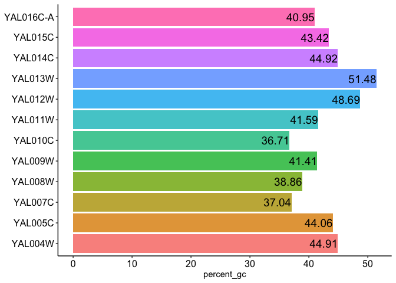

<!-- README.md is generated from README.Rmd. Please edit that file -->

# fastaR

<!-- badges: start -->

[](https://github.com/sethiyap/fastaR)
[](https://www.tidyverse.org/lifecycle/#experimental)
<!-- badges: end -->

Fasta sequence manipulation is required while performing gene set or
genome-wide analysis in RNASeq and ChIPSeq. Sequences of group of genes
belonging to a pathway or biological term helps to determine the
motifs/signature sequences associated with those genes. It also helps to
predict regulators for differentially enriched genes. fastaR provides
different ways to manipulate and gather information from the set of
sequences. For instance, summary of input fasta file `(fa_summary)` or
percentage of GC in given sequences `(fa_percent_GC)`. Additionally,
gene list specific sequences `(fa_some_records)` or promoters for given
genes can also be fetched `(get_promoter_from_feature)`. Together,
fastaR provides easy way to analyze and manipulate sequences with
minimal input of a feature file `(bed or gff)` and/or reference genome
file `(.fa or .fasta)`.

## Install

    if(require("devtools")){
            options(repos = BiocManager::repositories())
            devtools::install_github("sethiyap/fastaR",build = FALSE)
    } else{
            options(repos = BiocManager::repositories())
            install.packages("devtools")
            devtools::install_github("sethiyap/fastaR", build = FALSE)
    }

## faUtils

### fa\_some\_records()

``` r
# Input list of genes
myGenelist <- system.file("exdata", "Sc_myGenelist.txt", package = "fastaR")
myGenelist <- scan(myGenelist,  what="character", sep=NULL)
head(myGenelist)
#> [1] "YDR343C" "YPL122C" "YCL066W" "YKR014C" "YHL018W" "YDR175C"

# Reference fasta sequence to be subsetted
ref_fasta <- system.file("exdata", "Sc_nucl_R64-2-1.fasta", package = "fastaR",mustWork = TRUE)

# Function
fastaR::fa_some_records(gene_list=myGenelist, fasta_file=ref_fasta, outfile="sc_myGenelist.fa")
#>   A BStringSet instance of length 0
```

### fa\_size()

``` r
ref_fasta <- system.file("exdata", "Sc_nucl_R64-2-1.fasta", package = "fastaR")
cc <- fastaR::fa_size(fasta_file=ref_fasta)
head(cc)
#> # A tibble: 6 x 2
#>   Seq_id  Length
#>   <chr>    <int>
#> 1 YAL001C   3483
#> 2 YAL002W   3825
#> 3 YAL003W    621
#> 4 YAL004W    648
#> 5 YAL005C   1929
#> 6 YAL007C    648
```

### fa\_summary()

``` r

ref_fasta <- system.file("exdata", "Sc_nucl_R64-2-1.fasta", package = "fastaR")
fs <- fastaR::fa_summary(fasta_file=ref_fasta)
print(t(fs))
#>               [,1]
#> num_of_seq   25.00
#> min         186.00
#> max        4071.00
#> mean       1604.64
#> median     1218.00
#> percent_gc   39.86
```

### fa\_percent\_GC()

  - for more than 20 sequences

<!-- end list -->

``` r
ref_fasta <- system.file("exdata", "Sc_nucl_R64-2-1.fasta", package = "fastaR")
ff <- fastaR::fa_percent_GC(fasta_file=ref_fasta)
head(ff)
#> # A tibble: 6 x 2
#>   names   percent_gc
#>   <chr>        <dbl>
#> 1 YAL001C       37.1
#> 2 YAL002W       37.2
#> 3 YAL003W       44.6
#> 4 YAL004W       44.9
#> 5 YAL005C       44.1
#> 6 YAL007C       37.0
```

  - for less than 20 sequences

<!-- end list -->

``` r
ref_fasta <- system.file("exdata", "Sc_nucl_subset.fa", package = "fastaR")
ft <- fastaR::fa_percent_GC(fasta_file=ref_fasta)
```



``` r
head(ft)
#> # A tibble: 6 x 2
#>   names   percent_gc
#>   <chr>        <dbl>
#> 1 YAL004W       44.9
#> 2 YAL005C       44.1
#> 3 YAL007C       37.0
#> 4 YAL008W       38.9
#> 5 YAL009W       41.4
#> 6 YAL010C       36.7
```

## getUtils

### get\_fasta\_from\_bed()

``` r

# path to bed (.bed) file
bed_file_in <- system.file("exdata","Sc_ref_genes.bed", package = "fastaR")

# path to reference genome sequence
ref_fasta <- system.file("exdata", "Sc_ref_genome.fasta", package = "fastaR")

fastaR::get_fasta_from_bed(bedFile=bed_file_in, fasta_file=ref_fasta, write_output=FALSE)
#> GRanges object with 6 ranges and 2 metadata columns:
#>       seqnames      ranges strand |        name     score
#>          <Rle>   <IRanges>  <Rle> | <character> <numeric>
#>   [1]     chrI     336-649      + |     YAL069W      <NA>
#>   [2]     chrI     539-792      + |   YAL068W-A      <NA>
#>   [3]     chrI   1808-2169      - |     YAL068C      <NA>
#>   [4]     chrI   2481-2707      + |   YAL067W-A      <NA>
#>   [5]     chrI   7236-9016      - |     YAL067C      <NA>
#>   [6]     chrI 10092-10399      + |     YAL066W      <NA>
#>   -------
#>   seqinfo: 2 sequences from an unspecified genome; no seqlengths
#>   A DNAStringSet instance of length 573
#>       width seq                                             names               
#>   [1]   314 TGATCGTAAATAACACACACGT...GGCGGTCCCAAATATTGTATAA YAL069W
#>   [2]   254 TGCACGGCACTTGCCTCAGCGG...ACTTTTCAACAATAATACATAA YAL068W-A
#>   [3]   362 ATGGTCAAATTAACTTCAATCG...GTATCTACACTATCGCAAACTA YAL068C
#>   [4]   227 TGCCAATTATAGGGGTGCCGAG...GTTGGGAGTCGTATACTGTTAG YAL067W-A
#>   [5]  1781 ATGTATTCAATTGTTAAAGAGA...TATCAGTATCTGATGAAAAATA YAL067C
#>   ...   ... ...
#> [569]   221 ATGGAACTTTTTATACCTTGCC...GGTCCGCGAAAACTTCCGGATA YBR298C-A
#> [570]  1754 TGACTATTTCTGATCATCCAGA...TAGAATCTACCTCGTCAAATAA YBR299W
#> [571]   497 ATGGCGGCAACACCAGCAGCGA...GCCACCTAATCTTTGTGCTCTA YBR300C
#> [572]   362 TGGTCAAACTAACTTCAATCGC...TATCTACACTATCGCAAACTAG YBR301W
#> [573]  1139 ATGAAAGAGAATGAACTTAAAA...GCAGTGAGGTGCTCTTAGTGTA YBR302C
```

### get\_promoter\_from\_feature()

``` r

# path to reference sequence file
ref_fasta <- system.file("exdata", "Sc_ref_genome.fasta", package = "fastaR")

# for gff as feature file
feature_file_in <- system.file("exdata","Sc_ref_genes.gff", package = "fastaR")
pr <- fastaR::get_promoter_from_feature(feature_file=feature_file_in, fasta_file=ref_fasta, write_outputfasta= FALSE, write_promoterbed= FALSE, upstream_bp= 1000, downstream_bp= 100)
#> GRanges object with 6 ranges and 1 metadata column:
#>       seqnames        ranges strand |       names
#>          <Rle>     <IRanges>  <Rle> | <character>
#>   [1]     chrI 151067-152166      - |     YAL001C
#>   [2]     chrI 142707-143806      + |     YAL002W
#>   [3]     chrI 141174-142273      + |     YAL003W
#>   [4]     chrI 139760-140859      + |     YAL004W
#>   [5]     chrI 141332-142431      - |     YAL005C
#>   [6]     chrI 138246-139345      - |     YAL007C
#>   -------
#>   seqinfo: 2 sequences from an unspecified genome; no seqlengths
pr
#>   A DNAStringSet instance of length 581
#>       width seq                                             names               
#>   [1]  1100 ACTTGTAAATATATCTTTTATT...ATGTCTCATTCTCCTTTTCGGC YAL001C
#>   [2]  1100 TTCCAAGGCCGATGAATTCGAC...GAATTTAGATCGTATACCCAAT YAL002W
#>   [3]  1100 CTTCATGTCAGCCTGCACTTCT...GGGTATGTTCCGATTTAGTTTA YAL003W
#>   [4]  1100 CCAATTTGTCACCAGCTTCAGA...ACCCAAGTCGAAAATCAAGACG YAL004W
#>   [5]  1100 CACTCATATCGGGGGTCTTACT...ATTGCCAACGATCAAGGTAACA YAL005C
#>   ...   ... ...
#> [577]  1100 GTGCGTGAAGGAGAAAACTTCG...TTACGTTGTTTGTATCATCCCA YBR298C-A
#> [578]  1100 TTCTTACCTTGCTCCTCCATCT...TTTAAAGACTCCAATAACGATG YBR299W
#> [579]  1100 CATGGCGTGGCTTGCTCCACAC...ACAAGAAATAGTGAAATGAAAG YBR300C
#> [580]  1100 AAGAAAAACACATGACCAGAAT...TCTGACGAAAGAGTCAACTTGG YBR301W
#> [581]  1100 AATTTATATACACTTATGCCAA...CTACCTCAAGATCTTTTCAGAA YBR302C

# for bed as feature file
feature_file_in <- system.file("exdata","Sc_ref_genes.bed", package = "fastaR")
pr <- fastaR::get_promoter_from_feature(feature_file=feature_file_in, fasta_file=ref_fasta, write_outputfasta= FALSE, write_promoterbed= FALSE, upstream_bp= 1000, downstream_bp= 100)
#> GRanges object with 6 ranges and 1 metadata column:
#>       seqnames     ranges strand |       names
#>          <Rle>  <IRanges>  <Rle> | <character>
#>   [1]     chrI      1-435      + |     YAL069W
#>   [2]     chrI      1-638      + |   YAL068W-A
#>   [3]     chrI  2070-3169      - |     YAL068C
#>   [4]     chrI  1481-2580      + |   YAL067W-A
#>   [5]     chrI 8917-10016      - |     YAL067C
#>   [6]     chrI 9092-10191      + |     YAL066W
#>   -------
#>   seqinfo: 2 sequences from an unspecified genome; no seqlengths
pr
#>   A DNAStringSet instance of length 573
#>       width seq                                             names               
#>   [1]   435 CCACACCACACCCACACACCCA...CTGATTTTACGTACGCACACGG YAL069W
#>   [2]   638 CCACACCACACCCACACACCCA...ATATCTCATTCGGCGGTCCCAA YAL068W-A
#>   [3]  1100 CATCCAAGAATTTTATCTACGA...TCTGACGAAAGAGTCAACTTGG YAL068C
#>   [4]  1100 AACGAAGCAGCGACTCATTTTT...ATATCCGAATTTTAGATTTGGA YAL067W-A
#>   [5]  1100 TATATCCGATTCATTCTTCTTT...GTGGAAGACCTGCCAGATGACT YAL067C
#>   ...   ... ...
#> [569]  1100 GTGCGTGAAGGAGAAAACTTCG...TTACGTTGTTTGTATCATCCCA YBR298C-A
#> [570]  1100 TCTTACCTTGCTCCTCCATCTC...TTAAAGACTCCAATAACGATGG YBR299W
#> [571]  1100 CATGGCGTGGCTTGCTCCACAC...ACAAGAAATAGTGAAATGAAAG YBR300C
#> [572]  1100 AGAAAAACACATGACCAGAATG...CTGACGAAAGAGTCAACTTGGT YBR301W
#> [573]  1100 AATTTATATACACTTATGCCAA...CTACCTCAAGATCTTTTCAGAA YBR302C
```

### get\_flank\_from\_feature()

flanks are different region in gene’s structure as illustrated below: 1.
sequence upstream of start coordinate 2. sequence downstream of start
coordinate 3. sequence downstream of end coordinate 4. upstream and
downstream of start coordinate 5. upstream and downstream of end
coordinate 6. upstream and downstream of feature/gene coordinates 7.
middle region, i.e. distance (in bp) from start and end coordinate
Start—–\>ATGCGGATGCGGTC\<——End

``` r

# path to reference sequence file
ref_fasta <- system.file("exdata", "Sc_ref_genome.fasta", package = "fastaR")

# for gff as feature file

feature_file_in <- system.file("exdata","Sc_ref_genes.gff", package = "fastaR")
ss <- fastaR::get_flank_from_feature(feature_file = feature_file_in, fasta_file = ref_fasta, flank_type = 2)
#> GRanges object with 6 ranges and 1 metadata column:
#>       seqnames        ranges strand |     gene_id
#>          <Rle>     <IRanges>  <Rle> | <character>
#>   [1]     chrI 151157-151166      - |     YAL001C
#>   [2]     chrI 143707-143716      + |     YAL002W
#>   [3]     chrI 142174-142183      + |     YAL003W
#>   [4]     chrI 140760-140769      + |     YAL004W
#>   [5]     chrI 141422-141431      - |     YAL005C
#>   [6]     chrI 138336-138345      - |     YAL007C
#>   -------
#>   seqinfo: 2 sequences from an unspecified genome; no seqlengths
ss
#>   A DNAStringSet instance of length 581
#>       width seq                                             names               
#>   [1]    10 ATGGTACTGA                                      YAL001C
#>   [2]    10 ATGGAGCAAA                                      YAL002W
#>   [3]    10 ATGGCATCCA                                      YAL003W
#>   [4]    10 ATGGGTGTCA                                      YAL004W
#>   [5]    10 ATGTCAAAAG                                      YAL005C
#>   ...   ... ...
#> [577]    10 ATGGAACTTT                                      YBR298C-A
#> [578]    10 ATGACTATTT                                      YBR299W
#> [579]    10 ATGGCGGCAA                                      YBR300C
#> [580]    10 ATGGTCAAAC                                      YBR301W
#> [581]    10 ATGAAAGAGA                                      YBR302C

# for bed file as feature file

feature_file_in <- system.file("exdata","Sc_ref_genes.bed", package = "fastaR")
ss <- fastaR::get_flank_from_feature(feature_file = feature_file_in, fasta_file = ref_fasta, flank_type = 2)
#> GRanges object with 6 ranges and 2 metadata columns:
#>       seqnames      ranges strand |        name     score
#>          <Rle>   <IRanges>  <Rle> | <character> <numeric>
#>   [1]     chrI     336-345      + |     YAL069W      <NA>
#>   [2]     chrI     539-548      + |   YAL068W-A      <NA>
#>   [3]     chrI   2160-2169      - |     YAL068C      <NA>
#>   [4]     chrI   2481-2490      + |   YAL067W-A      <NA>
#>   [5]     chrI   9007-9016      - |     YAL067C      <NA>
#>   [6]     chrI 10092-10101      + |     YAL066W      <NA>
#>   -------
#>   seqinfo: 2 sequences from an unspecified genome; no seqlengths
ss
#>   A DNAStringSet instance of length 573
#>       width seq                                             names               
#>   [1]    10 TGATCGTAAA                                      YAL069W
#>   [2]    10 TGCACGGCAC                                      YAL068W-A
#>   [3]    10 ATGGTCAAAT                                      YAL068C
#>   [4]    10 TGCCAATTAT                                      YAL067W-A
#>   [5]    10 ATGTATTCAA                                      YAL067C
#>   ...   ... ...
#> [569]    10 ATGGAACTTT                                      YBR298C-A
#> [570]    10 TGACTATTTC                                      YBR299W
#> [571]    10 ATGGCGGCAA                                      YBR300C
#> [572]    10 TGGTCAAACT                                      YBR301W
#> [573]    10 ATGAAAGAGA                                      YBR302C
```

### get\_random\_sequences\_from\_fasta()

``` r

# load reference fasta
ref_fasta <- system.file("exdata", "Sc_ref_genome.fasta", package = "fastaR")

rr <- fastaR::get_random_sequences_from_fasta(fasta_file = ref_fasta,
                                 numberOfRandomSequences = 100,
                                 lengthOfRandomSequence = 500)
#> GRanges object with 6 ranges and 1 metadata column:
#>                                                                                    seqnames
#>                                                                                       <Rle>
#>   [1] chrII [org=Saccharomyces cerevisiae] [strain=S288C] [moltype=genomic] [chromosome=II]
#>   [2] chrII [org=Saccharomyces cerevisiae] [strain=S288C] [moltype=genomic] [chromosome=II]
#>   [3] chrII [org=Saccharomyces cerevisiae] [strain=S288C] [moltype=genomic] [chromosome=II]
#>   [4] chrII [org=Saccharomyces cerevisiae] [strain=S288C] [moltype=genomic] [chromosome=II]
#>   [5] chrII [org=Saccharomyces cerevisiae] [strain=S288C] [moltype=genomic] [chromosome=II]
#>   [6]   chrI [org=Saccharomyces cerevisiae] [strain=S288C] [moltype=genomic] [chromosome=I]
#>              ranges strand |        names
#>           <IRanges>  <Rle> |     <factor>
#>   [1] 618816-619316      - | random_seq_1
#>   [2] 135291-135791      + | random_seq_2
#>   [3] 591756-592256      - | random_seq_3
#>   [4] 123908-124408      + | random_seq_4
#>   [5] 318119-318619      - | random_seq_5
#>   [6]   92658-93158      + | random_seq_6
#>   -------
#>   seqinfo: 2 sequences from an unspecified genome; no seqlengths

rr
#>   A DNAStringSet instance of length 100
#>       width seq                                             names               
#>   [1]   501 AGTTCCTTTTGCCTTGCCGGCT...TTATACAGCCGTGCAACACCGT random_seq_1
#>   [2]   501 TGTTCTTCCATAAATTGGAAAC...ATTTTCTTGTTTGGTTTTTATT random_seq_2
#>   [3]   501 ACGACAAACAAGGTTTCCCAAT...TTGTCTGAAAGAAAGGCTGAAA random_seq_3
#>   [4]   501 AGGCGCATAAAATCTCTCAGTG...AAATACCGTTATCAAAGTGGTA random_seq_4
#>   [5]   501 ATAAGTTTCAATATACGTAAAG...TTCTGGAGCTTTGTTACATTGC random_seq_5
#>   ...   ... ...
#>  [96]   501 TTCATTTTTTGATATTCTCTTC...TTCCCAAATGATTAATATTAAT random_seq_96
#>  [97]   501 AGAAGTTGACCCCAACATATCT...ACCCATTTAAAGAACTCCCACC random_seq_97
#>  [98]   501 GCTTTCCAGTCATATAATCTAT...TTTGGCAACTTCATGCACATGT random_seq_98
#>  [99]   501 CCGCAGGAAGGACCCCTCTCTG...CAGGATGGTCACGGTGCCATTC random_seq_99
#> [100]   501 ATATATTAACTGTCCATGAAGA...GGCTCTTTTAGTTCCAAGGCCT random_seq_100
```
