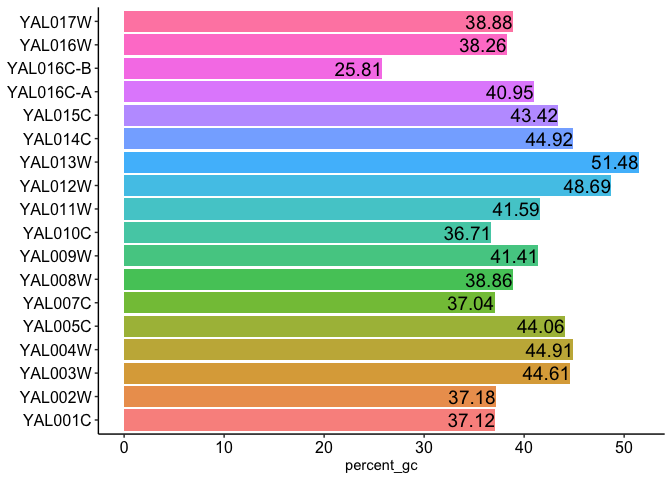

<!-- README.md is generated from README.Rmd. Please edit that file -->
fastaR
======

<!-- badges: start -->
<!-- [](https://www.tidyverse.org/lifecycle/#experimental) -->
<!-- [](https://shields.io/category/platform-support) -->
<!-- badges: end -->
### faUtils

``` r
faSize(fasta_file="Sc_orf_coding_R64-2-1.fasta")
```

<table class="table table-striped table-condensed table-responsive" style="font-size: 14px; width: auto !important; margin-left: auto; margin-right: auto;">
<thead>
<tr>
<th style="text-align:left;font-weight: bold;color: black !important;">
Seq\_id
</th>
<th style="text-align:left;font-weight: bold;color: black !important;">
Length
</th>
</tr>
</thead>
<tbody>
<tr>
<td style="text-align:left;color: blue !important;">
YAL001C
</td>
<td style="text-align:left;color: blue !important;">
3483
</td>
</tr>
<tr>
<td style="text-align:left;color: blue !important;">
YAL002W
</td>
<td style="text-align:left;color: blue !important;">
3825
</td>
</tr>
<tr>
<td style="text-align:left;color: blue !important;">
YAL003W
</td>
<td style="text-align:left;color: blue !important;">
621
</td>
</tr>
<tr>
<td style="text-align:left;color: blue !important;">
YAL004W
</td>
<td style="text-align:left;color: blue !important;">
648
</td>
</tr>
<tr>
<td style="text-align:left;color: blue !important;">
YAL005C
</td>
<td style="text-align:left;color: blue !important;">
1929
</td>
</tr>
<tr>
<td style="text-align:left;color: blue !important;">
YAL007C
</td>
<td style="text-align:left;color: blue !important;">
648
</td>
</tr>
</tbody>
</table>
``` r
faSomeRecords(gene_list=myGenelist , fasta_file="Sc_orf_trans_all_R64-2-1.fasta", outfile="sc_myGenelist.fa")
faSummary(fasta_file="Sc_orf_coding_R64-2-1.fasta")
```

<table class="table table-striped table-condensed table-responsive" style="font-size: 14px; width: auto !important; margin-left: auto; margin-right: auto;">
<thead>
<tr>
<th style="text-align:left;font-weight: bold;color: black !important;">
</th>
<th style="text-align:left;font-weight: bold;color: black !important;">
Summary
</th>
</tr>
</thead>
<tbody>
<tr>
<td style="text-align:left;color: blue !important;">
num\_of\_seq
</td>
<td style="text-align:left;color: blue !important;">
18.00
</td>
</tr>
<tr>
<td style="text-align:left;color: blue !important;">
min
</td>
<td style="text-align:left;color: blue !important;">
186.00
</td>
</tr>
<tr>
<td style="text-align:left;color: blue !important;">
max
</td>
<td style="text-align:left;color: blue !important;">
4071.00
</td>
</tr>
<tr>
<td style="text-align:left;color: blue !important;">
mean
</td>
<td style="text-align:left;color: blue !important;">
1485.67
</td>
</tr>
<tr>
<td style="text-align:left;color: blue !important;">
median
</td>
<td style="text-align:left;color: blue !important;">
1192.50
</td>
</tr>
<tr>
<td style="text-align:left;color: blue !important;">
percent\_gc
</td>
<td style="text-align:left;color: blue !important;">
40.43
</td>
</tr>
</tbody>
</table>
``` r
faPercentGC(fasta_file = "Sc_orf_coding_R64-2-1.fasta")
#> plotting GC percent for each sequence
```


<table class="table table-striped table-condensed table-responsive" style="font-size: 14px; width: auto !important; margin-left: auto; margin-right: auto;">
<thead>
<tr>
<th style="text-align:left;font-weight: bold;color: black !important;">
names
</th>
<th style="text-align:left;font-weight: bold;color: black !important;">
percent\_gc
</th>
</tr>
</thead>
<tbody>
<tr>
<td style="text-align:left;color: blue !important;">
YAL001C
</td>
<td style="text-align:left;color: blue !important;">
37.12
</td>
</tr>
<tr>
<td style="text-align:left;color: blue !important;">
YAL002W
</td>
<td style="text-align:left;color: blue !important;">
37.18
</td>
</tr>
<tr>
<td style="text-align:left;color: blue !important;">
YAL003W
</td>
<td style="text-align:left;color: blue !important;">
44.61
</td>
</tr>
<tr>
<td style="text-align:left;color: blue !important;">
YAL004W
</td>
<td style="text-align:left;color: blue !important;">
44.91
</td>
</tr>
<tr>
<td style="text-align:left;color: blue !important;">
YAL005C
</td>
<td style="text-align:left;color: blue !important;">
44.06
</td>
</tr>
<tr>
<td style="text-align:left;color: blue !important;">
YAL007C
</td>
<td style="text-align:left;color: blue !important;">
37.04
</td>
</tr>
</tbody>
</table>
